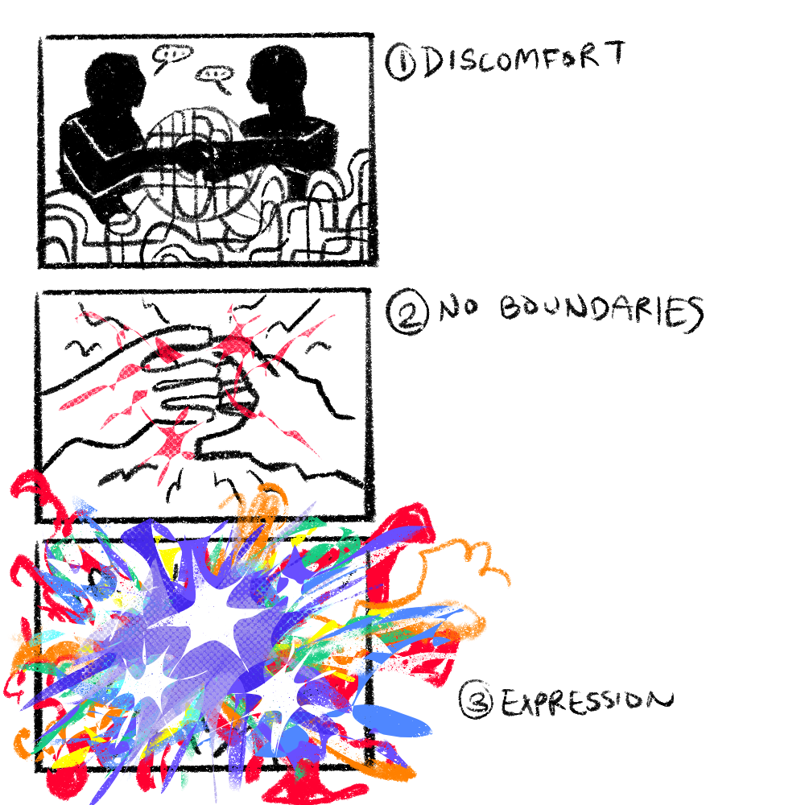
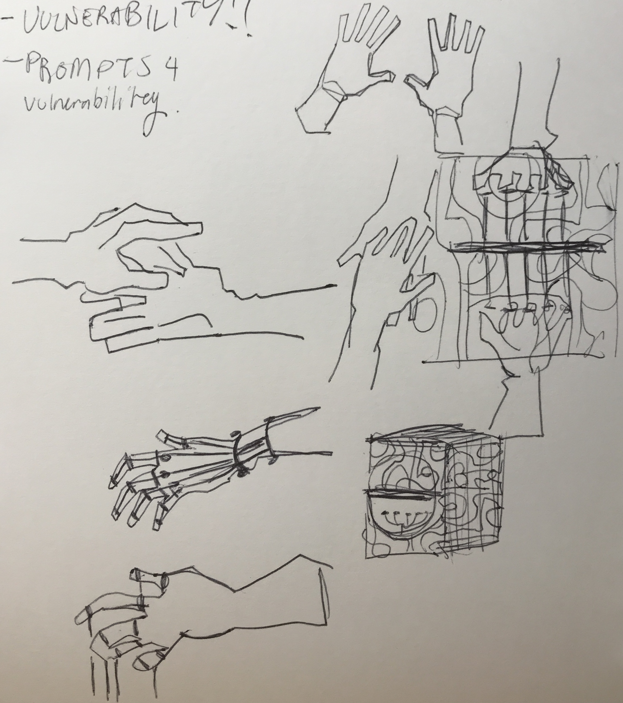
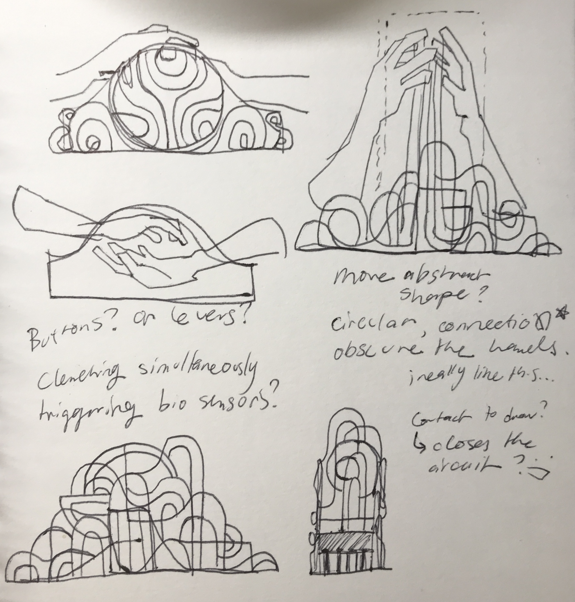
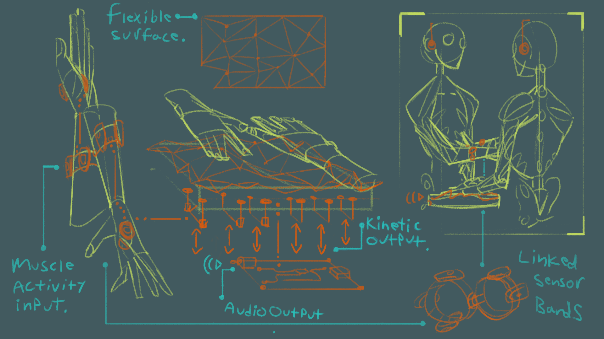

# mutual-ground
 A physical device prototype exploring closeness and communication.

---
## Project description:

[mutual ground] is an installation piece that intervenes in public and private spaces where it is displayed on an interpersonal-communications level. It can be seen as a specialized electronic device in the home or workplace, or a publicly available resource in an exhibition setting, meant to challenge the user’s conception of two-way streams of communication between people via an intimate & transformative physical contact interface.

The piece is meant to foster a conversation-type interaction among two people entangled in abstract sensorial communication with each other and the device, which reacts to input from muscle activity sensors placed in the users’ forearms. The device transforms sensor input into kinetic sculptural movement that can be experienced by touching the shifting surface of the artifact. Users are afforded a way of transmitting signals to each other through a mutual performance that encourages a breakthrough past the initial discomfort of physical touch needed to activate the device, into a type of understanding and collaboration.

## Design intentions:
The unspoken rules of engagement in social life often impose codified patterns of communication. The exchange of ideas and transmission of inner experience from one human mind to another are mediated in subtle and unsubtle ways by the spatial settings and device interfaces that we use to talk to each other. [mutual ground] offers an out-of-the-ordinary conduit for expression and interpretation of social performance enacted in a language that is continually and mutually developed, even as the users' socially acceptable boundaries of physical closeness are challenged and expanded.

## Design strategies and sensor evaluation:
[mutual ground] takes a conversing system of interaction as its primary model, to achieve the goal of an abstracted version of social collaboration between two users. In a conversing system two or more learning systems (such as humans) feed into each other, reacting to a mutually produced output. In the case of [mutual ground] two humans must mediate their output intentions through an artifact that engages them by providing an initially obscure set of kinetic affordances, while at the same time reacting to the kinetic sensorial output coming from their interlocutor. 

A EMG muscle sensor (or a similar kind of muscle or pressure sensor) would act as the filter of action-intention for each user in this conversation. Narrowing down their output affordances to those provided by the mechanisms of the kinetic sculpture before them, and thus enforcing a learning curve for the mastery of this new type of social performance. Similarly, on the receiving end, there would exist a necessary layer of interpretation of the resulting movements -- one complemented by physical touch, the visible body language, and the facial expressions of both users. [mutual ground] would also make use of the body’s electrical conductivity to close the circuit of the device upon physical touch between the users, and activate it. The prerequisite of physical touch is meant to emphasize the need for intimate collaboration.

---
## Storyboard illustrations & Wishlist:

## Similar projects:

### Atau Tanaka - Meta Gesture:
https://www.youtube.com/watch?v=bvaws0wMgDc&t=2300s

Atau Tanaka uses EMG muscle sensors strapped to his forearms to compose live electronic music --essentially turning his own body into an instrument. Using custom software, he maps muscle contraction data to an ‘information space’ made up of sliced up pieces of existing orchestral performances, on which two separate neural networks are trained to generate sound at performance-time. Some of his pieces use a single network driven by gestures on both arms, while others map a single sensor armband to separate networks. Tanaka moves his whole body when he performs, striking poses at a macro scale as well as micro gestures localized to the fingers in his hands. This makes for an entrancing and otherworldly experience for the audience. And what looks like an exponentially more engaging process of musical exploration for Atau himself.
Our project aims to explore the use of muscle activation signals like Tanaka’s. However it extends its use to answer the question; what if the audience was included in the generation of the performance? Blurring the line between the roles of performer and audience. Mutual Ground also extends on Meta Gesture by testing to what extent the same level of engagement-learning in a primitive-reactive experience can be achieved via traditional non-ML computational techniques.

### The Auerglass:
http://www.taubaauerbach.com/view.php?id=243 

The Auerglass is a two-person pump organ created by visual artist Tauba Auerbach and singer-songwriter Cameron Mesirow (known professionally by Glasser). Similarly to our project, the Auerglass is a two-person instrument and cannot be played alone: each player has a keyboard with alternating notes, and each player has to pump air to supply the other player’s notes. 

Much like our project, the Auerglass forces players to collaborate and cooperate in order to achieve expression. However, the Auerglass brings together experienced musicians who are able to practice using the instrument beforehand until they are fully comfortable. While mistakes are being made and appreciated and accepted for what they are, there is still a rehearsed piece the musicians are attempting to perform. There is no rehearsal for our project. There is no familiarity or comfort. We want to bring together two strangers to an unfamiliar experience and force them to confront the intimacies and hesitancies and tribulations that come with creation and collaboration and communication and interacting with another person. The Auerglass is a collaborative means of expression – our project is a psychological experiment that invites collaborators to become much more intimate than initially expected.

### The Strandbeest:
https://www.strandbeest.com/

Since 1990, Dutch artist Theo Jansen has been building kinetic structures capable of moving on their own – Strandabeest. The Strandabeest are skeletons constructed with yellow plastic tubes and are able to harness wind power in order to walk on their own. Each year, Jansen researches and builds a new iteration of the Strandabeest – playing God and guiding the evolution of this artificial life.

The only similarities drawn between the two projects are their identities as kinetic sculptures, their aesthetics (should we decide to continue down a wire-esque sculptural route, playing with negative space and lines and flow and skeletons), and their (unavoidable, due to the nature of our class) associations with their respective scientific fields (engineering and circuitry). Thematically, our projects are focusing on completely different topics, with Jansen exploring evolution and the intersection between engineering and art, whereas we are focusing on intimacy and relationship psychology and using science as a material instead of an inspiration.
