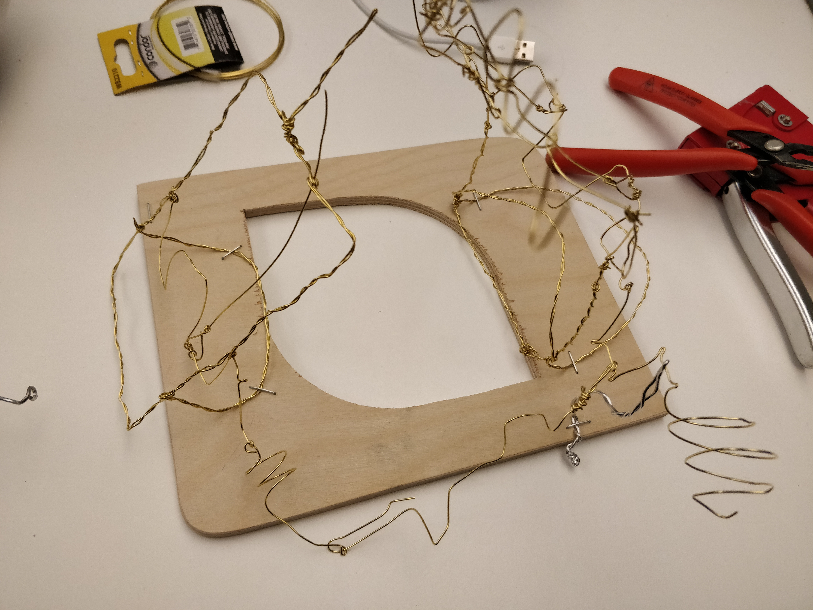
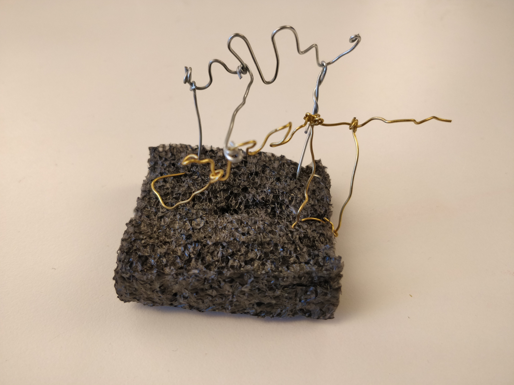
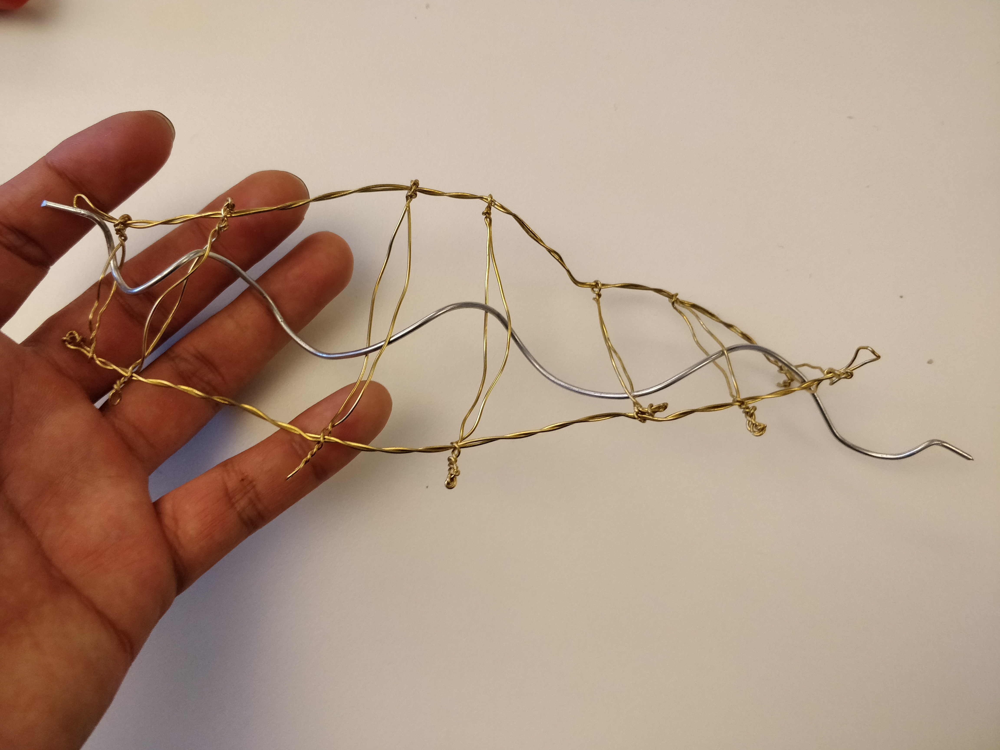
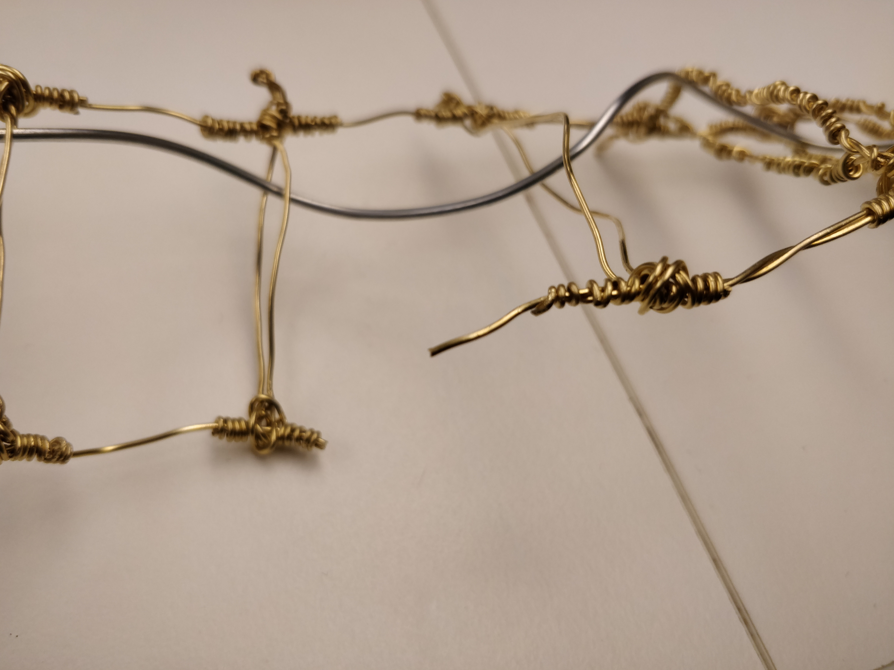
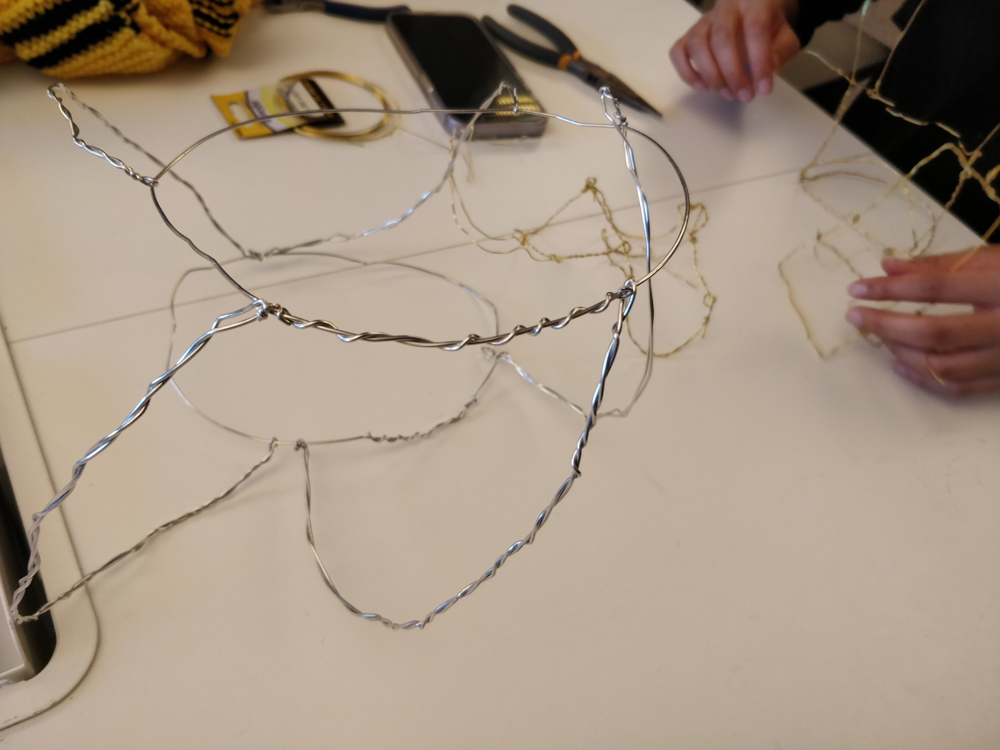
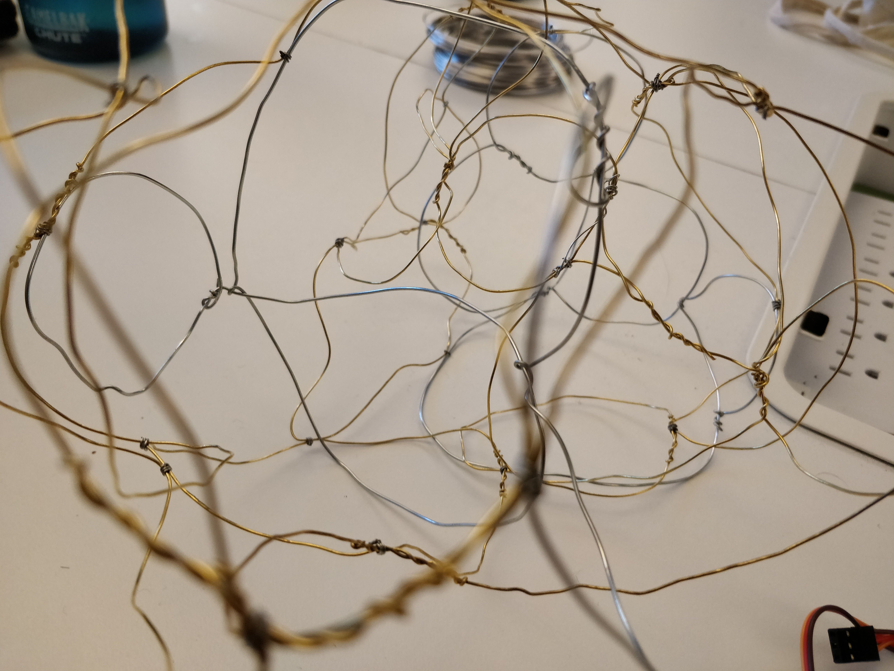

## prototype progress report:

- ### [process video 1](https://youtu.be/w3zF_32yoPg) 
- ### [process video 2](https://youtu.be/o77rQLUDhls)

Our ideation was solidified from the get-go, but our prototype fell short. Through the process leading up to the prototype presentation, we discovered that our material was a lot harder to work with than we had expected and spent a lot of time trying to understand it. We decided that it would be best to work with a thicker wire for ease and better haptics, but spent very little time on the physical computing. This meant that we had unforeseen problems with the sensors we were planning on using, and will potentially have to divert from our original imaginings of [mutual ground].

Working with wire in the context of kinetic sculpture and automata proved to be difficult across a number of domains. Structural integrity & malleability, movement transfer & mechanical design and ease of manipulation from a construction technique perspective. These factors made for an unwieldy iteration loop as we discovered what works and what doesn’t in each of the domains, time spent investigating one kind of automata design came with an associated learning curve very different from that of another. And with no easy way to streamline the process in par with the process of discovery.

Abigail focused on linear movement crank-driven automata, using variable width bends in a rotating horizontal rotating pole attached to a fixed frame to displace loosely attached wires on the vertical axis; this proved to be the more successful approach. Leo spent a lot of time evaluating an overlapping motion contraption driven by a spiral crank embedded within a flexible frame, known as the fish tail. The first iteration of the fish tail seemed promising, but its movement was highly irregular and disorganised, parts would slide unintentionally causing it to jam, displacing the spiral crank out of the structure like a screw. Attempts to reinforce it caused too much resistance and caused a rigid movement quality, sometimes impeding it altogether. The fish tail finally broke in an attempt to achieve a functional variability between malleable and structurally integral parts in its construction.

In the case of both types of automata, multiple iterations were needed to familiarise ourselves with the ideal crafting techniques. The measurement of wire lengths, braiding, looping and joining, as well as bending --by hand and with pliers-- for a satisfactory functional and aesthetic effect are skills that were difficult and very rewarding to acquire.

Our initial intention or supposed meaning hasn’t changed over the course of researching and implementing the physical prototype: we still intend to highlight the difficulties of communicating and make participants uncomfortable in order to make them reevaluate their connection and communication with one another – that has always been the driving core of our project. However, since the presentation, the manner in which this message is presented, the intended interaction might slightly change. Originally, we intended to have a larger sculpture that would encapsulate both participants’ hands, but for the prototype we settled on a shared bracelet for convenience. After the presentation, we began considering this idea of a shared veil that would be draped over the two participants, creating discomfort via eye contact and proximity over touch alone. Due to accessibility and convenience issues with our muscle sensors, we plan on exploring heat or capacitive sensors to sense when people are participating.

Other material iteration included experimentation into a spherical structure or mesh to house the kinetic components and wearable peripherals also, mesh-like and glove-like, to be used by two people at once to activate the device. 

The spherical housing lacked structural integrity when scaled up closer to desired dimensions. The glove peripheral was evaluated for individual use, and more experimentation is needed to come up with a two-user manifestation of the design.

The mesh-like haptic wearable was interesting, and we were able to validate it's sensorial affordances when two people introduced their hands in it. However, its general function was somewhat ambiguous, which is why we decided to explore the more communicative glove design.
